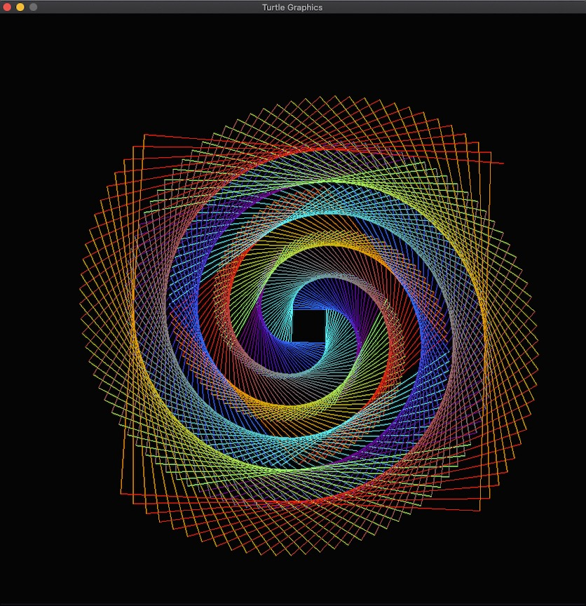

<h1 align="center">
  <br>
    </a>
  <br>
    Turtle Assembler
  <br>
</h1>

<h4 align="center">A C implementation of the LOGO programming language with an ARM Assembly extension.</h4>

<p align="center">
  <a href="#Features">Features</a> |
  <a href="#Overview">Overview</a> |
  <a href="#Design">Design</a>     |
  <a href="#Testing">Testing</a>   |
  <a href="#Usage">Usage</a>       |
  <a href="#License">License</a>   
</p>

# Features
- Classic LOGO commands that enable the user to move the turtle around the screen
- ARM assembly instructions extension to introduce assembly programming to beginners
- Test driven development - custom testing harness that performs black box and white box testing

# Overview
Many attempts have been made to create programming languages which are intuitive and easy to learn. One of the best of these was LOGO which allowed children as young as 3 to learn a computer language. A subset of this language involved a “turtle” which could be driven around the screen using simple instructions.

I noticed the lack of fun and interactive ways to learn ARM assembly and thought I'd do something about it. Moreover, rather than developing something completely novel, it made more sense to repurpose and extend the base LOGO language to incorporate basic assembly instructions and take advantage of its existing features. I believe this is an important aspect in software engineering, where it is important to add value by taking advantage of current technologies and repurposing them.

Moreover, most modern programming languages have pretty much abstracted away the intricacies of code, with modern day developers having almost little, to no clue as to what is happening at the assembly level. This program should hopefully act as some sort of taster to assembly.

I have included some examples in this [folder](../assembler/samples) so kindly do check it out!

# Design
The software package is essentially a [recursive descent parser](https://en.wikipedia.org/wiki/Recursive_descent_parser) with an interpreter module. The parser ensures that the code conforms to the [formal grammar](#formal-bnf-grammar) and the interpreter then executes each individual instruction.

# Testing
## Parser
For the parser, a combination of blackbox and whitebox testing (unit tests and assertions) was used with the strategy summarised as follows:

- **White box testing**: 
  - Unit tests to validate individual parts of the formal grammar. Unit tests are named using the format `UTXXX_instruction_description_of_test` where `XXX` represents the test number. These files can be found [here](./parser/ttl_files/Unit_tests). 
  - Assertions were performed on functions in the parser module to ensure they were functioning as expected.
- **Black box testing:**
  - The parser was batch run on the *.ttl files in [this folder](./parser/ttl_files/Black_box/).
- The above white box and black box testing were automated using a [test harness](./parser/test_parser.c) and a summary of the results (with test failures highlighted) is presented on the terminal window after execution.


To execute the test harness, type the following two commands on your terminal: 

```bash
cd parser
make run_test_parse
```

## Interpreter
For the interpreter, there was a greater reliance on assert testing to make sure that the tokens being parsed translated into the expected interpretation. This meant that functions within the interpreter module were made to return booleans which facilitatated the use of assert testing for interpreter validation. The testing methodology is summarised as follows:

- **White box testing**: 
  - Assertions were performed on functions in the interpreter module to ensure they were functioning as expected.
- **Black box testing:**
  - The interpreter was batch run on the *.ttl files in [this folder](./interpreter/ttl_files/Black_box/) using a [version of the interpreter without SDL output](./interpreter/interpreter_no_SDL.c).
- The above white box and black box testing were automated using this [test harness](./interpreter/test_interpreter.c) and a summary of the results (with test failures highlighted) is presented on the terminal window after execution.

To execute the test harness, type the following two commands on your terminal: 
  ```bash
  cd interpreter
  make run_test_interpreter
  ```

## Assembler
For the assembler (basically an extended interpreter module) module, a similar test methodology was used as in the case of the interpreter - mainly assertions and black box testing *.ttl files in [this folder](assembler/ttl_files/Black_box/).  

- **White box testing**: 
  - Assertions were performed on additional functions in the assembler module to ensure they were functioning as expected.
- **Black box testing:**
  - The assembler module was batch run on the *.ttl files in [this folder](./assembler/ttl_files/Black_box/) using a [version of the interpreter without SDL output](./assembler/extension_no_SDL.c).
- The above white box and black box testing were automated using this [test harness](./assembler/test_extension.c) and a summary of the results (with test failures highlighted) is presented on the terminal window after execution.

To execute the test harness, type the following two commands on your terminal: 
  ```bash
  cd assembler
  make run_test_extension
  ```

# Usage
## Setup 
Ensure you have [GCC](https://gcc.gnu.org) installed on your machine. Once you have done so, run the following command on your terminal to compile and run an example of the basic version:

```bash
cd assembler
make extension
```

Once compilation is complete, create a .ttl file that conforms to the formal BNF grammar and save it in the current directory. You can then run this file by typing this in your terminal window:

```turtle
./extension your_file.ttl
```

## Variables
Variables are set using [reverse polish notation](https://en.wikipedia.org/wiki/Reverse_Polish_notation).

## Loops
Loops are performed by:
```
DO A FROM 1 to 7 {
  INSTRUCTIONS
}
```
## Basic Instructions

| Instruction           | Description                                                                       |
| --------------------- | --------------------------------------------------------------------------------- |
| `FD varnum`      | Moves turtle forward varnum pixels |
| `RT varnum`       | Rotates the turtle right by varnum degrees                                      |
| `LT varnum`         | Rotates the turtle left by varnum degrees                                   |
| `MOVETO x y` | Moves the turtle to coordinates specified by x and y                           |
| `DO` | Bitwise OR of r_op1 and r_op2 and result stored in r_d                            |
| `XOR r_d r_op1 r_op2` | Bitwise XOR of r_op1 and r_op2 and result stored in r_d                           |
| `NOT r_d`             | Bitwise NOT of r_d                                                                |
| `LSL r_d r_op1`       | Logical Shift Left of r_d by r_op1                                                |
| `LSR r_d r_op1`       | Logical Shift Right of r_d by r_op1                                               |


## Assembly Instructions
Turtle Assembler provides users with 5 general purpose, 8-bit registers (r0 - r4) and the following assembly instructions:

| Instruction           | Description                                                                       |
| --------------------- | --------------------------------------------------------------------------------- |
| `MVR r_d varnum`      | Moves into register r_d a decimal number or the decimal number represented varnum |
| `LDR r_d r_op1`       | Copies the contents of register r_op1 to r_d                                      |
| `STR r_d var`         | Copies the contents of r_d into a variable var.                                   |
| `AND r_d r_op1 r_op2` | Bitwise AND of r_op1 and r_op2 and result stored in r_d                           |
| `ORR r_d r_op1 r_op2` | Bitwise OR of r_op1 and r_op2 and result stored in r_d                            |
| `XOR r_d r_op1 r_op2` | Bitwise XOR of r_op1 and r_op2 and result stored in r_d                           |
| `NOT r_d`             | Bitwise NOT of r_d                                                                |
| `LSL r_d r_op1`       | Logical Shift Left of r_d by r_op1                                                |
| `LSR r_d r_op1`       | Logical Shift Right of r_d by r_op1                                               |

Additionally, the user has the option of modifying the colour of the pen by teweaking the red, green and blue components.

| Instruction       | Description                                     |
| ----------------- | ----------------------------------------------- |
| `PENCOL_R varnum` | modifies the red component of the line colour   |
| `PENCOL_B varnum` | modifies the blue component of the line colour  |
| `PENCOL_G varnum` | modifies the green component of the line colour |

Each of these components can take a value between 0-255, i.e. an unsigned 8-bit number, which is exactly the size of the registers provided by the Turtle Assembler.

For example, if the B component of the RGB triplet was 0 and if the user would like to make it 255, the following code would do it:
 
```       
    MVR r0 1
    
    DO A FROM 1 TO 7 {
        MVR r1 1
        MVR r2 A
        LSL r1 r2
        ORR r0 r0 r1
    }
    
    STR r0 B
    
    PENCOL_B := B
```

The piece of code above would set the line colour to blue and helps visualise bitwise operations, elementary assembly, and looping. 

## Examples
### Rose
<p align="center">
    
</p>

```
{
   SET R := 255 ;
   SET G := 255 ;
   SET B := 255 ;
   
   MVR r0 R
   XOR r0 r0 r0
   STR r0 R

   MVR r0 G
   MVR r1 0
   AND r0 r0 r1
   STR r0 G
   
   PENCOL_R := R
   PENCOL_G := G

   SET A := 200 ;
   SET B := 60 ;
   SET C := 12 ;
   
   DO D FROM 1 TO 30 {
      DO E FROM 1 TO 6 {
         FD A
         RT B
      }
   RT C
   }
}
```

### Faded Concentric Rings
<p align="center">
    
</p>

```
{
    PENCOL_G := 0
    PENCOL_B := 0
    
    DO I FROM 75 TO 255 {    

        SET N := 0 ;

        PENCOL_R := I
        FD 100
        PENCOL_R := N
        
        RT 30
        
        PENCOL_G := I
        FD 50
        PENCOL_G := N

        LT 60
        
        PENCOL_B := I
        FD 50
        PENCOL_B := N
        FD 100

        RT 30

        MOVETO 0 0

        RT 2
    }
}
```
### Multicoloured Spiral
<p align="center">
    
</p>

```
{
   SET T := 90.911 ;

   DO X FROM 1 TO 500 {
    
        SET R := X 1 * 256 | ;
        SET G := X 127 * 256 | ;
        SET B := X 255 * 256 | ;

        PENCOL_R := R
        PENCOL_G := G
        PENCOL_B := B

        SET C := 50 X + ;
        FD C
        RT T
   }
}
```

## Formal BNF Grammar

```
<MAIN> ::= "{" <INSTRCTLST>
<INSTRCTLST> ::= <INSTRUCTION><INSTRCTLST> | "}"
<INSTRUCTION> ::= <FD> |
                  <LT> |
                  <RT> |
                  <DO> |
                  <SET> |
                  <MOVETO> |
                  <PENCOL_R> |
                  <PENCOL_G> |
                  <PENCOL_B> |
                  <MVR> |
                  <STR> |
                  <LDR> |
                  <AND> |
                  <ORR> |
                  <XOR> |
                  <NOT> |
                  <LSL> |
                  <LSR> |

<FD> ::= "FD" <VARNUM>
<LT> ::= "LT" <VARNUM>
<RT> ::= "RT" <VARNUM>
<DO> ::= "DO" <VAR> "FROM" <VARNUM> "TO" <VARNUM> "{" <INSTRCTLST>
<VAR> ::= [A-Z]
<VARNUM> ::= number | <VAR>
<SET> ::= "SET" <VAR> ":=" <POLISH>
<POLISH> ::= <OP><POLISH> | <VARNUM><POLISH> | ";"
<OP> ::= "+" | "-" | "*" | "/" | "|"
<MOVETO> ::= <VARNUM> <VARNUM>
<PENCOL_R> ::= "PENCOL_R" ":=" <VARNUM>
<PENCOL_G> ::= "PENCOL_G" ":=" <VARNUM>
<PENCOL_B> ::= "PENCOL_B" ":=" <VARNUM>
<MVR> ::= "MVR" <REG> <VARNUM>
<STR> ::= "STR" <REG> <VAR>
<LDR> ::= "LDR" <REG> <REG>
<AND> ::= "AND" <REG> <REG> <REG>
<ORR> ::= "ORR" <REG> <REG> <REG>
<XOR> ::= "XOR" <REG> <REG> <REG>
<NOT> ::= "NOT" <REG>
<LSL> ::= "LSL" <REG> <REG> <REG>
<LSR> ::= "LSR" <REG> <REG> <REG>
<REG> ::= "r0" | "r1" | "r2" | "r3" | "r4"
```

# License

```
Copyright (c) 2021 Keane Fernandes

Permission is hereby granted, free of charge, to any person obtaining a copy
of this software and associated documentation files (the "Software"), to deal
in the Software without restriction, including without limitation the rights
to use, copy, modify, merge, publish, distribute, sublicense, and/or sell
copies of the Software, and to permit persons to whom the Software is
furnished to do so, subject to the following conditions:

The above copyright notice and this permission notice shall be included in all
copies or substantial portions of the Software.

THE SOFTWARE IS PROVIDED "AS IS", WITHOUT WARRANTY OF ANY KIND, EXPRESS OR
IMPLIED, INCLUDING BUT NOT LIMITED TO THE WARRANTIES OF MERCHANTABILITY,
FITNESS FOR A PARTICULAR PURPOSE AND NONINFRINGEMENT. IN NO EVENT SHALL THE
AUTHORS OR COPYRIGHT HOLDERS BE LIABLE FOR ANY CLAIM, DAMAGES OR OTHER
LIABILITY, WHETHER IN AN ACTION OF CONTRACT, TORT OR OTHERWISE, ARISING FROM,
OUT OF OR IN CONNECTION WITH THE SOFTWARE OR THE USE OR OTHER DEALINGS IN THE
SOFTWARE.
```

